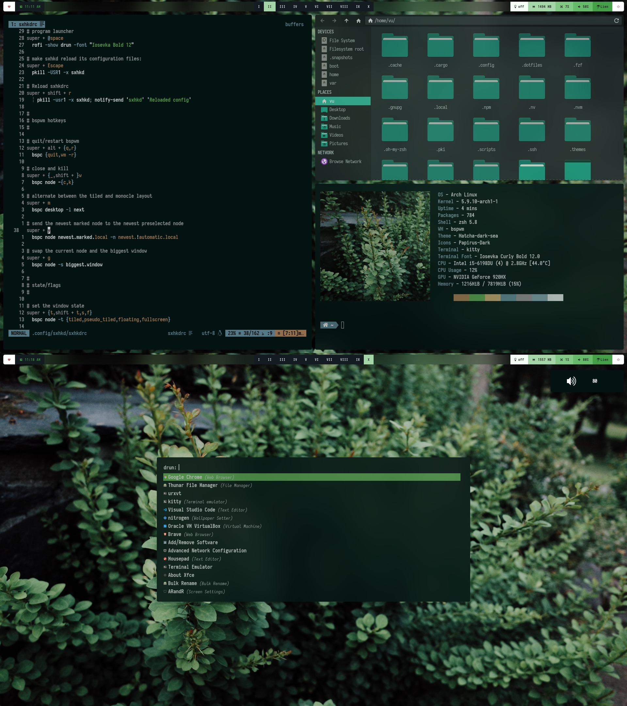

# Matcha vibe dotfiles (Arch - bspwm - Polybar - rofi - dunst)

- OS: Arch Linux
- WM: bspwm + sxhkd
- Compositer: [picom](https://github.com/ibhagwan/picom) by ibhagwan
- Bar: Polybar
- Notification: Dunst
- Icon-theme: Papirus (teal)
- GTK-theme: Matcha-dark-sea
- Font: Iosevka Nerd Font
- Colorscheme: pywal

